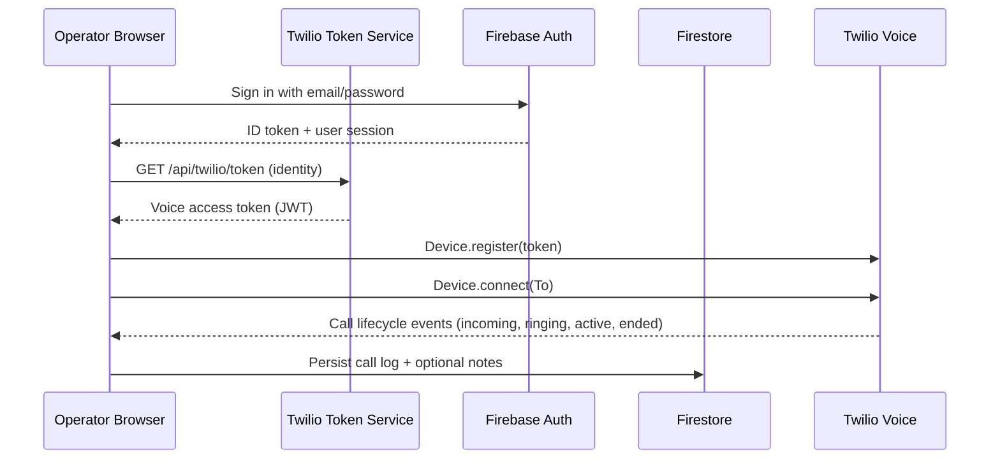
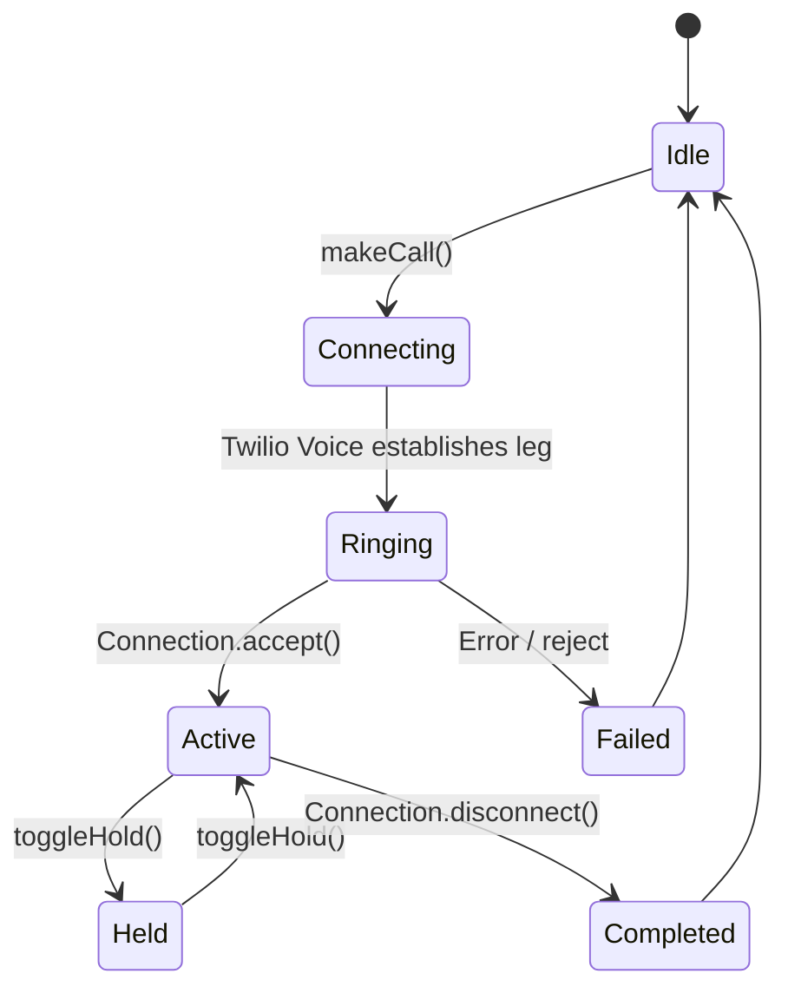

# Twilio Voice Dialer Integration Flow

This document explains how the browser dialer authenticates operators, retrieves Twilio Voice access tokens, places inbound/outbound calls, and persists call logs/notes. Use it as an onboarding reference when configuring new environments or extending the project.

## High-Level Sequence

## Authentication & Authorization

1. Operators authenticate through Firebase Authentication on `/auth`.
2. Successful sign-in populates the `AuthContext` and unlocks protected routes.
3. Firestore security rules (see [`firestore.rules`](../firestore.rules)) ensure that:
   - Each user can read/write only their own `voiceProfiles/{uid}` document.
   - Call logs (`users/{uid}/callLogs`) are readable by the owner but writable only through the application client or trusted backend integrations.

## Twilio Client Initialisation

1. `TwilioClientProvider.initializeClient()` requests an access token from the Express server (`/api/twilio/token`).
2. The token service signs the request with `TWILIO_API_KEY_SID/TWILIO_API_KEY_SECRET` and embeds the configured TwiML App SID.
3. A `Device` instance from `@twilio/voice-sdk` is created with the token, event listeners are attached for registration, errors, and inbound calls, and `device.register()` is invoked.
4. On `tokenWillExpire` the provider refreshes the token and updates the device instance in place.
5. Cleanup on sign-out or unmount destroys the device, clears listeners, and resets local state.

## Outbound Call Lifecycle

1. When an operator presses **Call**, the dialer:
   - Ensures the Twilio device is registered by awaiting `initializeClient()`.
   - Creates a pending call log in Firestore (`createUserCallLog`).
   - Invokes `device.connect({ params: { To } })` with the destination number (E.164).
2. During the call the operator can toggle mute/hold. These actions call `connection.mute()` / `connection.hold()` and append entries to the event feed.
3. DTMF digits are sent via `connection.sendDigits()` and mirrored in the UI.
4. When the Twilio connection emits `disconnect` or `error`, the provider finalises the Firestore log with status, duration, and the captured notes.

## Inbound Call Handling

- `device.on('incoming')` emits a `Connection` that the provider buffers until the agent accepts or rejects the call.
- Accepting calls (`acceptIncomingCall`) answers the connection, creates a Firestore log with `direction: 'inbound'`, and opens the call window.
- Rejecting or ignoring the connection leaves the caller in their TwiML flow (configure your TwiML app to route to voicemail/queue as needed).

## Call & Event Logs

- `useCallLogs` reads `users/{uid}/callLogs` via React Query. When no remote logs exist, seeded mock entries appear for orientation.
- The Twilio client context keeps a rolling list of events (max 100) that the Event Logs page renders for troubleshooting.
- Notes entered during the call are synced to the context and stored when the call log is finalised.

## Voice Workspace Management

- `/voice-workspace` binds to `voiceProfiles/{uid}` and lets agents (or admins) toggle outbound/inbound permissions, recording policy, caller ID, and identity alias.
- These values are available for future admin tooling and can be used in Twilio Functions/webhooks to enforce policy server-side.

## Failure Handling & Recovery

- Device or connection errors update `connectionStatus` and surface actionable messages in the dialer UI.
- Token refresh failures prompt a retry and log an event; when unrecoverable the UI falls back to onboarding messaging.
- Operators can manually reinitialise by refreshing the dialer after correcting credentials or network issues.

## Extensibility Tips

- Rotate tokens server-side and extend the Express app with additional webhook handlers (status callbacks, recordings, etc.).
- Forward Twilio recording and call-status callbacks into Cloud Functions to enrich Firestore logs with authoritative data.
- Integrate Twilio Voice Insights or Event Streams for QoS dashboards and SLA alerts.

For deeper SDK capabilities refer to the Twilio Voice SDK documentation and map new features through this provider-first architecture.
